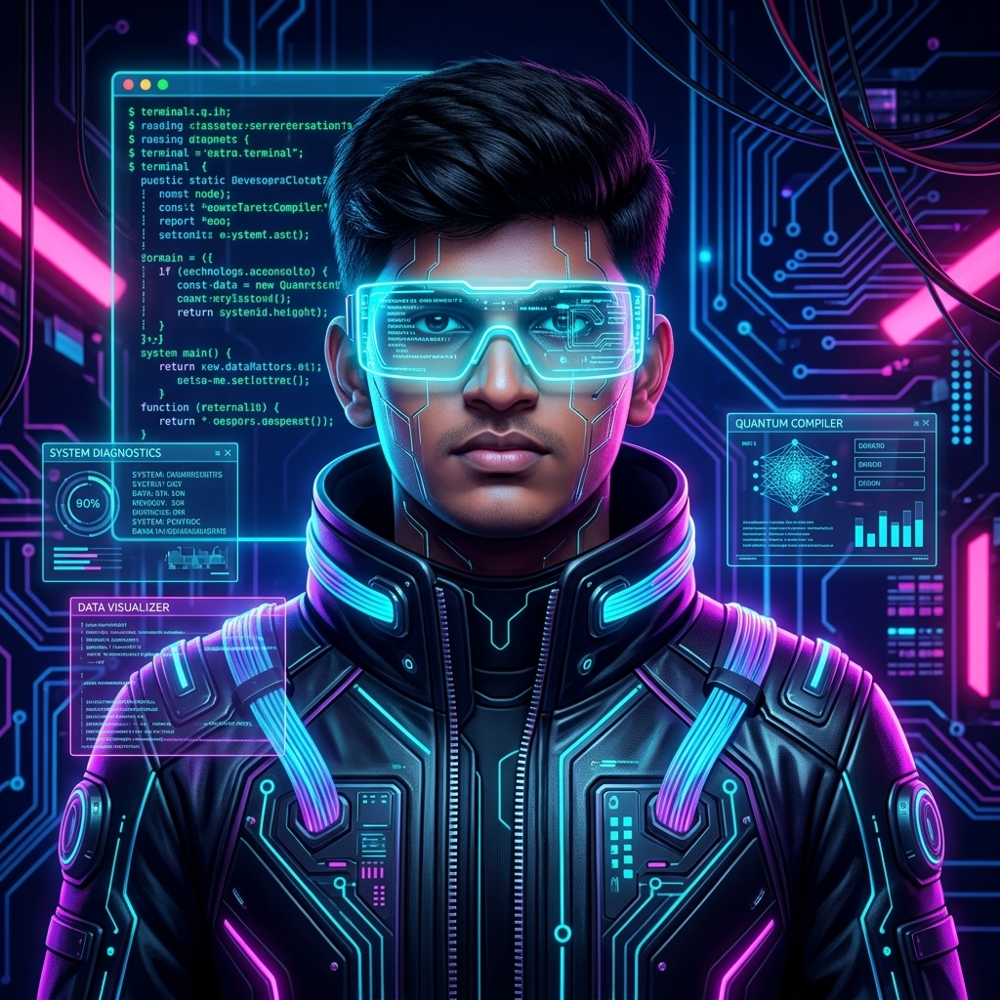

<div align="center">
  
  
  <br/>
  
  <h1>Hi 👋, I'm Prakash R</h1>
  
  
</div>


## 💫 About Me

<table align="center" width="100%" style="border-collapse: collapse; border: none;">
  <tr style="border: none;">
    <td align="center" width="30%" valign="middle" style="border: none;">
      
    </td>
    <td width="70%" valign="top" style="border: none; padding-left: 20px;">
      <p>🎓 <b>B.Tech in Computer Science & Business Systems</b> from V.S.B. Engineering College, Karur</p>
      <p>📍 Namakkal, Tamil Nadu, India</p>
      <p>🚀 I am a passionate Software Engineer and Full Stack Developer enthusiastic about Artificial Intelligence, Web Technologies, and robust backend architectures. I love crafting scalable web applications, intelligent AI-driven solutions, and clean interactive software.</p>
      <p>🌱 <b>Currently Learning & Exploring:</b> AI & Machine Learning Integrations, Full Stack Web Architecture, Microservices, and Competitive DSA in Java & Python.</p>
    </td>
  </tr>
</table>


## ⚒️ Tech Stack

<table align="center" width="100%" style="border-collapse: collapse; border: none;">
  <tr style="border: none;">
    <td align="left" valign="top" width="50%" style="border: none; padding: 10px;">
      <h4>☕ Languages & Core</h4>
      
    </td>
    <td align="left" valign="top" width="50%" style="border: none; padding: 10px;">
      <h4>⚙️ Backend & Databases</h4>
      
    </td>
  </tr>
  <tr style="border: none;">
    <td align="left" valign="top" width="50%" style="border: none; padding: 10px;">
      <h4>🎨 Frontend & Web</h4>
      
    </td>
    <td align="left" valign="top" width="50%" style="border: none; padding: 10px;">
      <h4>🛠️ Tools & Cloud Platforms</h4>
      
    </td>
  </tr>
</table>


## 🚀 Featured Projects

<table width="100%" style="border-collapse: collapse; border: none;">
  <tr style="border: none;">
    <td width="50%" valign="top" style="border: none; padding: 15px;">
      <h3>🤖 <a href="https://github.com/PRAKASH-2012/Customer-Support-Resolution-Assistant">Customer Support Resolution Assistant</a></h3>
      <p><i>AI-powered resolution engine for automated customer support triage, query categorization, and sentiment-aware responses.</i></p>
      <ul>
        <li>Automated ticket categorization and NLP-driven resolution matching</li>
        <li>Interactive web UI with live API integration</li>
        <li>Deployed live on Render cloud platform</li>
      </ul>
      <p>
        
        
        
        <a href="https://customer-support-resolution-assistant.onrender.com"></a>
      </p>
    </td>
    <td width="50%" valign="top" style="border: none; padding: 15px;">
      <h3>🛡️ <a href="https://github.com/PRAKASH-2012/Unified-Scam-Detection-Fraud-Prevention-Platform">Unified Scam & Fraud Detection Platform</a></h3>
      <p><i>Proactive threat detection platform monitoring malicious links, fraudulent schemes, and financial scam attempts.</i></p>
      <ul>
        <li>Real-time pattern analysis for suspicious indicators and fraud markers</li>
        <li>Clean, intuitive dashboard for incident reporting and risk scoring</li>
        <li>Engineered with scalable security-first architecture</li>
      </ul>
      <p>
        
        
        
      </p>
    </td>
  </tr>
  <tr style="border: none;">
    <td width="50%" valign="top" style="border: none; padding: 15px;">
      <h3>🎓 <a href="https://github.com/PRAKASH-2012/AI-Internship-Recommendation-Engine">AI Internship Recommendation Engine</a></h3>
      <p><i>Smart recommendation algorithm matching student profiles and skill sets with optimal internship opportunities.</i></p>
      <ul>
        <li>Skill-gap evaluation and personalized career trajectory recommendations</li>
        <li>Instant client-side recommendation engine with high-performance UI</li>
        <li>Live on GitHub Pages</li>
      </ul>
      <p>
        
        
        
        <a href="https://prakash-2012.github.io/AI-Internship-Recommendation-Engine/"></a>
      </p>
    </td>
    <td width="50%" valign="top" style="border: none; padding: 15px;">
      <h3>🎮 <a href="https://github.com/PRAKASH-2012/survivor">Survivor – Arcade Action Game</a></h3>
      <p><i>Fast-paced arcade survival web game featuring smooth movement mechanics, live leaderboards, and responsive gameplay.</i></p>
      <ul>
        <li>Dual control support: responsive keyboard and touch navigation</li>
        <li>Saved user sessions, score persistence, and competitive leaderboard</li>
        <li>Engineered with TypeScript and optimized HTML5 Canvas render loop</li>
      </ul>
      <p>
        
        
        
      </p>
    </td>
  </tr>
  <tr style="border: none;">
    <td width="50%" valign="top" style="border: none; padding: 15px;">
      <h3>🚌 <a href="https://github.com/PRAKASH-2012/Smart-Rural-Bus-Journey-Planner">Smart Rural Bus Journey Planner</a></h3>
      <p><i>Public transit navigation platform tailored for rural commuters to find accurate routes, timings, and schedules.</i></p>
      <ul>
        <li>Route calculation and schedule lookup optimized for transit clarity</li>
        <li>Lightweight, mobile-first design suited for low-bandwidth rural connectivity</li>
        <li>Intuitive stop-by-stop search and travel estimates</li>
      </ul>
      <p>
        
        
        
      </p>
    </td>
    <td width="50%" valign="top" style="border: none; padding: 15px;">
      <h3>🌊 <a href="https://github.com/PRAKASH-2012/Integrated-Platform-for-Crowdsourced-Ocean-Hazard">Crowdsourced Ocean Hazard Platform</a></h3>
      <p><i>Community-driven marine safety platform collecting, verifying, and mapping real-time ocean hazard notifications.</i></p>
      <ul>
        <li>Interactive map interface visualizing crowd-submitted hazard reports</li>
        <li>Instant hazard reporting with location tagging and alert categories</li>
        <li>Live deployment on GitHub Pages</li>
      </ul>
      <p>
        
        
        <a href="https://prakash-2012.github.io/Integrated-Platform-for-Crowdsourced-Ocean-Hazard/"></a>
      </p>
    </td>
  </tr>
</table>


## 🏆 Competitive Programming & Problem Solving

<table align="center" width="100%" style="border-collapse: collapse; border: none;">
  <tr style="border: none;">
    <td align="center" width="60%" valign="middle" style="border: none;">
      <a href="https://leetcode.com/u/PRAKASHRAMACHANDRAN/">
        
      </a>
    </td>
    <td width="40%" valign="top" style="border: none; padding-left: 20px;">
      <h4>🧩 Solved Challenges & DSA</h4>
      <ul>
        <li><b>Preferred Languages:</b> Java ☕ & Python 🐍</li>
        <li><b>Core Focus:</b> Data Structures, Algorithmic Optimization & Problem Solving</li>
        <li><b>LeetCode Profile:</b> <a href="https://leetcode.com/u/PRAKASHRAMACHANDRAN/">leetcode.com/u/PRAKASHRAMACHANDRAN/</a></li>
        <li><b>Solutions Repository:</b> <a href="https://github.com/PRAKASH-2012/Leetcode">PRAKASH-2012/Leetcode</a></li>
      </ul>
    </td>
  </tr>
</table>


## 📊 GitHub Analytics

<table align="center" width="100%" style="border-collapse: collapse; border: none;">
  <tr style="border: none;">
    <td align="center" width="50%" style="border: none; padding: 10px;">
      
    </td>
    <td align="center" width="50%" style="border: none; padding: 10px;">
      
    </td>
  </tr>
  <tr style="border: none;">
    <td align="center" width="50%" style="border: none; padding: 10px;">
      
    </td>
    <td align="center" width="50%" style="border: none; padding: 10px;">
      
    </td>
  </tr>
</table>

<p align="center">
  
</p>

### 🐍 Contribution Snake

<picture>
  <source media="(prefers-color-scheme: dark)" srcset="https://raw.githubusercontent.com/PRAKASH-2012/PRAKASH-2012/output/github-snake-dark.svg">
  <source media="(prefers-color-scheme: light)" srcset="https://raw.githubusercontent.com/PRAKASH-2012/PRAKASH-2012/output/github-snake.svg">
  
</picture>


## 🎯 2026 Goals & Current Focus

<table align="center" width="100%" style="border-collapse: collapse; border: none;">
  <thead>
    <tr style="border: none; border-bottom: 2px solid #b300ff;">
      <th align="left" style="border: none; padding: 10px;">📚 Learning</th>
      <th align="left" style="border: none; padding: 10px;">🚀 Building</th>
      <th align="left" style="border: none; padding: 10px;">🎯 Goal</th>
    </tr>
  </thead>
  <tbody>
    <tr style="border: none;">
      <td style="border: none; padding: 10px;">Full Stack Architecture & Cloud</td>
      <td style="border: none; padding: 10px;">Scalable Web Applications</td>
      <td style="border: none; padding: 10px;">Software Development Engineer</td>
    </tr>
    <tr style="border: none;">
      <td style="border: none; padding: 10px;">AI/ML & NLP Integrations</td>
      <td style="border: none; padding: 10px;">Smart Assistants & Agents</td>
      <td style="border: none; padding: 10px;">Production AI Applications</td>
    </tr>
    <tr style="border: none;">
      <td style="border: none; padding: 10px;">Data Structures & Algorithms</td>
      <td style="border: none; padding: 10px;">High-Efficiency Solutions</td>
      <td style="border: none; padding: 10px;">Competitive Problem Solving</td>
    </tr>
    <tr style="border: none;">
      <td style="border: none; padding: 10px;">System Design & Microservices</td>
      <td style="border: none; padding: 10px;">Secure & Distributed Systems</td>
      <td style="border: none; padding: 10px;">Open Source Contributions</td>
    </tr>
  </tbody>
</table>


## 📜 Certifications

- 🏅 **Infosys Springboard** – Java Foundation (OOPs, Arrays, Methods, Exception Handling, Problem Solving)
- 🏅 **Web & Cloud Technologies** – Full Stack Development Fundamentals


## ☕ The Developer Blueprint

```java
public class Developer {
    private String name = "Prakash R";
    private String[] skills = {"Java", "Python", "Full Stack", "AI & ML", "DSA"};
    private boolean passionate = true;
    
    public void code() {
        while (passionate) {
            learnEmergingTechnologies();
            buildImpactfulProjects();
            solveDSAProblems();
            contributeToOpenSource();
        }
    }
    
    private void learnEmergingTechnologies() { /* Code. Learn. Improve. Repeat. */ }
    private void buildImpactfulProjects() { /* Scalability, security & aesthetics */ }
    private void solveDSAProblems() { /* Optimal time and space complexity */ }
    private void contributeToOpenSource() { /* Community impact & collaboration */ }
}
```

> 💭 **"Code with purpose, build with passion, innovate without limits."**


## 🌐 Connect With Me

<p align="center">
  <a href="https://github.com/PRAKASH-2012">
    
  </a>
  <a href="https://leetcode.com/u/PRAKASHRAMACHANDRAN/">
    
  </a>
</p>

---

<div align="center">
  <h3>⭐ If you find my projects helpful, feel free to star my repositories!</h3>
  
</div>
